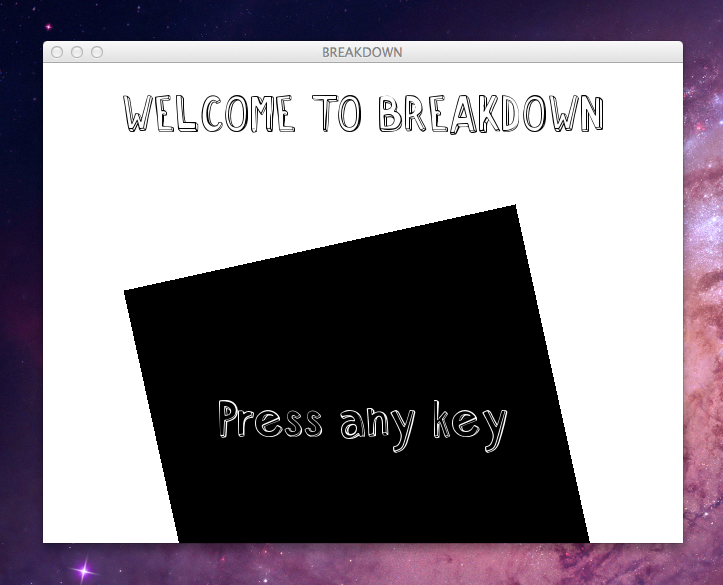
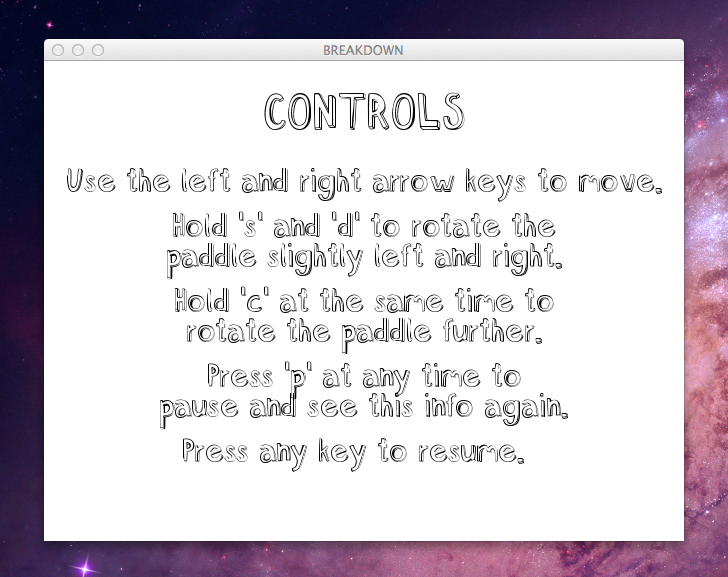
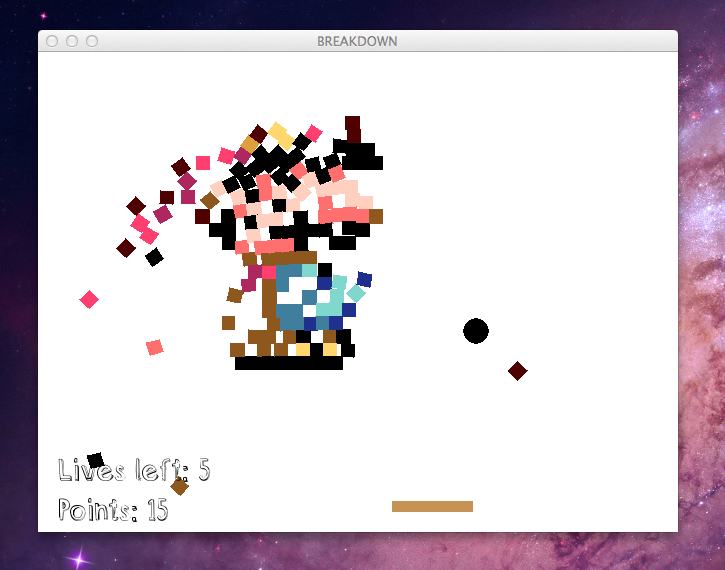



**Breakdown** is a remake of the classic breakout games popular since the advent of PDA mobile games.

It is open source and written in Python and Box2D. [Fork it on GitHub!](http://github.com/nybblr/cs4496-project-3)

## Installation
Breakdown needs a few dependencies:
- Python (2.7.3 tested)
- PyBox2D 2.02b2
- SWIG
- PyGame

Detailed installation directions can be found at the [GitHub page.](http://github.com/nybblr/cs4496-project-3)

## Screenshots

