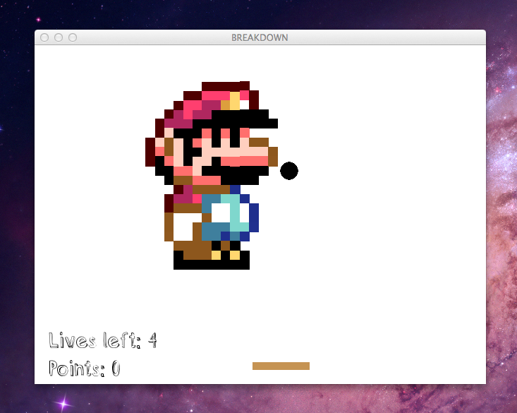



**Breakdown** is a remake of the classic breakout games popular since the advent of PDA mobile games. The game features realtime physics gameplay (thanks to Box2D), various powerups (like inertial warp), and easy level creation from PNG sprites.

The goal of the game is to breakdown the sprite till the screen is empty --- but you'll get more points for doing that in style. Some of the blocks are locked, but banging them a few times will loosen them up. Completely obliterate blocks before they leave the screen, and you'll get a 5 point bonus. Race against the clock and get 20 points in 2 seconds to get an inertial warp, which renders your ball oblivious to bounce interactions with puny pixel blocks.

The game is simple to play: use the left and right arrow keys to move the paddle, and tilt the paddle with "s" and "d". Hitting "c" at the same time activates extreme tilt.

**Breakdown** is open source and written in Python and Box2D. [Fork it on GitHub!](http://github.com/nybblr/cs4496-project-3)

## Installation
Breakdown needs a few dependencies:
- Python (2.7.3 tested)
- PyBox2D 2.02b2
- SWIG
- PyGame

Detailed installation directions can be found at the [GitHub page.](http://github.com/nybblr/cs4496-project-3)

## Screenshots

